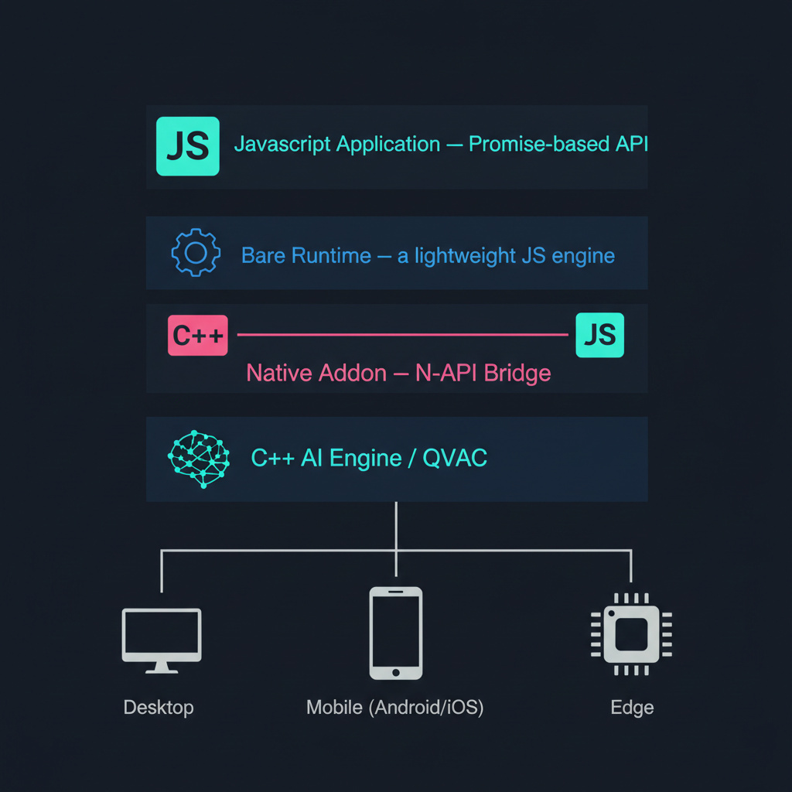
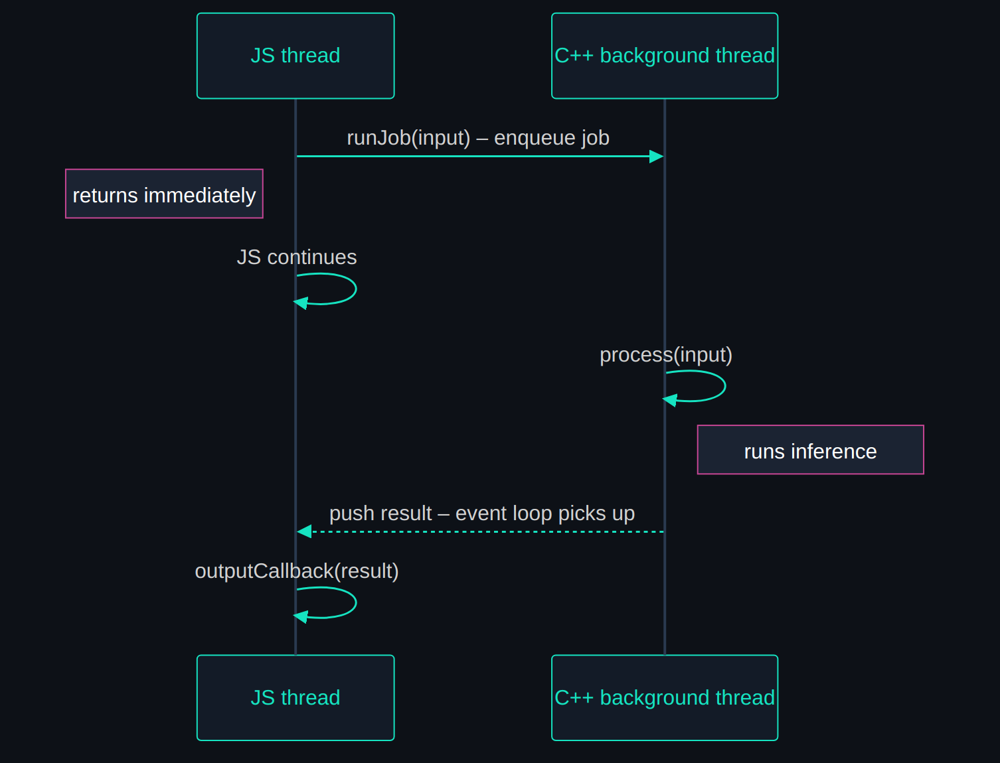

# Building an AI Addon for Bare: From C++ to JavaScript

**A hands-on guide for JavaScript/C++ developers building native AI addons**

## Introduction

Fast inference demands C++. Rapid development and a massive ecosystem favor a scripting language. For shipping products, JavaScript is hard to beat.

Most JS runtimes, however, carry baggage — a browser-grade engine, a large standard library, platform-specific quirks — and that overhead matters when embedding an AI module on a mobile device or a resource-constrained edge node. [Bare](https://bare.pears.com/) by Pears is a minimal JavaScript runtime designed for exactly this: a small, embeddable JS engine with first-class native addon support, running on all major platforms.

In this post we walk through the full process of building a C++ AI addon for Bare, from CMake configuration to JavaScript API, using a simple binary classifier as our running example. The model itself — logistic regression — is intentionally trivial; we focus on the addon setup, not on model implementation details. Once the plumbing is in place, you can swap in any engine: a deep neural network, a transformer, an existing AI engine — the addon pattern is unchanged. Production addons built on [QVAC](https://qvac.tether.io/) already use this pattern for state-of-the-art LLM inference, enabling on-device AI that keeps data private and works offline.



## Anatomy of a Bare Addon

A Bare addon is a shared library (`.so`, `.dylib`, or `.dll`) that the runtime loads at `require.addon()` time. The C++ side exports functions that JavaScript can call, and communication flows through the Bare N-API-style C interface (`js_env_t`, `js_value_t`, etc.) — opaque types that represent the JavaScript execution environment and JS values on the C++ side.

For an AI addon, three operations form the minimal surface area:

| Function | Purpose |
|---|---|
| `createInstance` | Allocate the model, wire up the callback pipeline |
| `runJob` | Submit input for inference (non-blocking) |
| `destroyInstance` | Free memory, tear down threads |


A fourth operation, `fit`, is specific to our example — it trains the logistic regression model and returns the learned weights. In a production addon backed by a large model you would load pre-trained weights instead.

## Setting Up the Build

Bare uses CMake as its build system. The `cmake-bare` package provides the `add_bare_module` helper that handles compiler flags, output naming, and platform quirks:

```cmake
find_package(cmake-bare REQUIRED PATHS node_modules/cmake-bare)
find_package(cmake-vcpkg REQUIRED PATHS node_modules/cmake-vcpkg)

project(classifier-addon C CXX)

add_bare_module(classifier-addon)
target_sources(${classifier-addon} PRIVATE addon/binding.cpp) # variable set by add_bare_module
# ...

```

`cmake-vcpkg` integrates vcpkg so C++ dependencies are fetched automatically. You declare them in a `vcpkg.json` manifest at the project root (see [our manifest](https://github.com/jesusmb1995/qvac-bare-addon-example/blob/main/vcpkg.json)) — the only entry is `qvac-lib-inference-addon-cpp`, which provides the addon framework we use to avoid writing boilerplate.

Below is `binding.cpp` — the file Bare loads. Each `V(name, fn)` macro registers a C++ function under a JS-visible name:

```cpp
#include <bare.h>
#include "AddonJs.hpp"

js_value_t*
classifierAddonExports(js_env_t* env, js_value_t* exports) {

#define V(name, fn)                                                            \
  {                                                                            \
    js_value_t* val;                                                           \
    if (js_create_function(env, name, -1, fn, nullptr, &val) != 0) {           \
      return nullptr;                                                          \
    }                                                                          \
    if (js_set_named_property(env, exports, name, val) != 0) {                 \
      return nullptr;                                                          \
    }                                                                          \
  }

  V("createInstance", classifier_addon::createInstance)
  V("runJob", classifier_addon::runJob)
  V("fit", classifier_addon::fit)
  V("destroyInstance",
    qvac_lib_inference_addon_cpp::JsInterface::destroyInstance)

#undef V
  return exports;
}

BARE_MODULE(classifier_addon, classifierAddonExports)
```

Notice that `destroyInstance` is bound directly from the library — no custom code needed. We only write the functions that are specific to our model.

These exported functions can be used from JavaScript by importing the addon:
```js
const binding = require.addon()

// Example usage
const handle = binding.createInstance(this, new Float64Array(weights), onOutputCb)
binding.runJob(handle, new Float64Array(features))
binding.fit(xArrays, yArray)
binding.destroyInstance(handle)
```

## Reducing Boilerplate with addon-cpp

Writing a native addon from scratch means dealing with a lot of repetitive plumbing: instance tracking, thread-safe reference counting, JS type marshalling, error propagation across the C++/JS boundary, output callback wiring. The [qvac-lib-inference-addon-cpp](https://github.com/tetherto/qvac) library handles all of this so you can focus on your model.

`JsInterface` is the main component — it contains a registry of model instances and provides a set of ready-to-bind functions (e.g. `JsInterface::destroyInstance`) that work with C++ models composed into the `AddonJs` class.

With the library in place, your addon-specific code reduces to:

1. **A model class** implementing `IModel` (just `getName()`, `process()`, and `runtimeStats()`)
2. **A `createInstance` function** that parses config, constructs the model, and composes it into an `AddonJs`
3. **A `runJob` function** that parses input and forwards it to `IModel::process`
4. **Any custom methods** (like `fit` in our example)

Everything else — `destroyInstance`, instance tracking, thread management, JS↔C++ error handling — is taken care of.

## The AddonCpp Engine: Non-blocking Inference

The key design point: `runJob` returns immediately with a boolean indicating whether the job was accepted. The model runs on a dedicated background thread. When it finishes, the result is pushed to an output queue where it can be picked up by the JS event loop. This means the JS thread is never blocked, even for expensive inference.



The core of our C++ implementation is the `LogisticRegression` class, which implements the `IModel` interface. It needs two main pieces: a constructor that receives the model weights, and a `process` function that runs inference.

`process` takes and returns `std::any`, so each addon defines its own input/output types without touching the framework — you cast to whatever C++ type your model expects and return the result the same way. This keeps the interface open for complex models that handle multiple input/output types through a single bridge point, and pairs naturally with JS's dynamic typing on the other side of the boundary.

The model itself is a single class implementing `IModel`:

```cpp
class LogisticRegression : public qvac_lib_inference_addon_cpp::model::IModel {
  std::vector<double> params_;

public:
  explicit LogisticRegression(std::vector<double> params)
      : params_(std::move(params)) {}

  std::any process(const std::any &input) override {
    auto features = std::any_cast<std::vector<double>>(input);

    // ... normalize features using stored mean/stddev, compute sigmoid ...

    return sigmoid(z); // probability as double
  }

  static std::vector<double> fit(const std::vector<std::vector<double>> &X,
                                 const std::vector<double> &y,
                                 int maxIter = 1000, double lr = 0.1) {
    // Gradient descent — returns [bias, w1, ..., wd, mu1, ..., mud, sd1, ..., sdd]
    // ... implementation details ...
  }
};
```

When writing our bridge functions (C++ to JS), `JsArgsParser` handles argument extraction and type casting from the JS call, throwing meaningful errors in misuse. In addition, `js::TypedArray<T>().as<>()` converts JS typed arrays into C++ containers.

Every bridge function is wrapped in a `try { ... } JSCATCH` block. `JSCATCH` is a macro that catches any C++ exception thrown during execution — whether from `JsArgsParser` validation, a failed type cast, or an error inside `process()` — and converts it into a JavaScript exception via the Bare N-API. This means a `throw std::runtime_error("bad input")` on the C++ side surfaces as a regular JS error that you can catch with `try/catch` or handle through Promise rejection, rather than crashing the process.

For example:
```cpp
args.get(0, "jsHandle")           // grabs the first positional argument
args.get(1, "weights")            // grabs the second argument (e.g. a Float64Array)
args.getFunction(2, "outputCallback") // grabs the third argument, asserting it is a function
```

To implement `createInstance`, we parse the arguments from `binding.createInstance(jsHandle, Float64Array, outputCallback)`:

```cpp
inline js_value_t *createInstance(js_env_t *env, js_callback_info_t *info) try {
  using namespace qvac_lib_inference_addon_cpp;

  JsArgsParser args(env, info);

  auto weights = js::TypedArray<double>(env, args.get(1, "weights"))
                     .as<std::vector<double>>(env);
```

We then create the model and wire up output handlers, which route and convert the return types of `process()` to the JS callback:
```cpp
  auto model = std::make_unique<LogisticRegression>(std::move(weights));

  // Register output handlers (double handler for probability)
  out_handl::OutputHandlers<out_handl::JsOutputHandlerInterface> outHandlers;
  outHandlers.add(std::make_shared<JsDoubleOutputHandler>());

  // Create the callback pipeline
  auto callback = std::make_unique<OutputCallBackJs>(
      env, args.get(0, "jsHandle"), args.getFunction(2, "outputCallback"),
      std::move(outHandlers));
```

Users of the library have the flexibility to implement custom handlers. The library provides built-in handlers for common types (`JsStringOutputHandler`, `JsTypedArrayOutputHandler`, etc.). For our case we defined a simple `JsDoubleOutputHandler` that converts `std::any(double)` to a JS number.

Finally we wrap the model in an `AddonJs` instance and register it with `JsInterface`:

```cpp
  // Bundle model + callback into AddonJs and register it
  auto addon =
      std::make_unique<AddonJs>(env, std::move(callback), std::move(model));

  return JsInterface::createInstance(env, std::move(addon));
}
JSCATCH
```

The `runJob` bridge retrieves the registered instance and forwards the input. It follows the same argument-parsing pattern as `createInstance`:

```cpp
inline js_value_t *runJob(js_env_t *env, js_callback_info_t *info) try {
  using namespace qvac_lib_inference_addon_cpp;

  JsArgsParser args(env, info);
  auto &instance = JsInterface::getInstance(env, args.get(0, "instance"));

  auto features = js::TypedArray<double>(env, args.get(1, "features"))
                      .as<std::vector<double>>(env);

  return instance.runJob(std::any(std::move(features)));
}
JSCATCH
```

The [`fit` bridge](https://github.com/jesusmb1995/qvac-bare-addon-example/blob/main/addon/AddonJs.hpp) follows the same argument-parsing pattern but doesn't need to retrieve an instance — it calls `LogisticRegression::fit` directly and returns the weights as a typed array.

> **Tip — Accessing your concrete model from a bridge function**
>
> Custom methods that need the model instance can retrieve it from `JsInterface` and downcast to the concrete type:
> ```cpp
> auto &model = dynamic_cast<LogisticRegression&>(*instance.addonCpp->model);
> model.someCustomMethod();
> ```
> This gives you direct access to any method beyond the `IModel` interface — useful for diagnostics, configuration changes, or domain-specific operations that don't fit the generic `process()` path.

## The JavaScript Wrapper

On the JS side we wrap the raw binding in a `ClassifierInterface` class that provides a Promise-based API:

- `constructor(params)` — calls `binding.createInstance`, stores the handle, and binds the output callback
- `predict(features)` — returns a Promise, calls `binding.runJob` under the hood
- `static fit(X, y)` — calls `binding.fit` directly and returns the learned weights
- `destroy()` — calls `binding.destroyInstance` to free the native instance

The callback passed to `createInstance` receives four arguments:

1. **addon** — the JS `this` handle
2. **event** — a type string identifying the output kind
3. **data** — the output payload (a number for predictions, an object for runtime stats)
4. **error** — an error string when something goes wrong

The `_onOutput` method in `addon.js` handles this routing — checking for errors, stashing the output, and settling on the final runtime-stats event:

```js
_onOutput (addon, event, data, error) {
  if (typeof error === 'string') {
    return this._settle(null, new Error(error))
  }

  if (typeof data === 'number') {
    this._result = data
  } else if (typeof data === 'object' && data !== null) {
    this._settle(this._result)
  }
}
```

The Promise wiring is straightforward — `predict` stashes the `resolve`/`reject` callbacks, and `_settle` fires whichever one applies when the native side delivers a result. Because `runJob` is non-blocking and the C++ side runs on its own thread, concurrent `predict()` calls would race on the shared `_resolve`/`_reject` state. We serialize access with a [`_withExclusiveRun`](https://github.com/jesusmb1995/qvac-bare-addon-example/blob/main/addon.js) critical section — a Promise-based queue that ensures only one job is in flight at a time:

```js
predict (features) {
  return this._withExclusiveRun(() => {
    return new Promise((resolve, reject) => {
      this._resolve = resolve
      this._reject = reject
      const accepted = binding.runJob(this._handle, new Float64Array(features))
      // ... reject immediately if not accepted ...
    })
  })
}

_settle (value, error) {
  const { _resolve: resolve, _reject: reject } = this
  this._resolve = null
  this._reject = null
  if (error) { if (reject) reject(error) } else { if (resolve) resolve(value) }
}
```

The callback is invoked twice per prediction. First with `data` as a number — the probability returned by `process()` — which we stash directly. Then with `data` as an object (runtime stats), signaling the job is complete, at which point we resolve the Promise. If `process()` throws, the framework catches the exception and delivers it as the `error` argument, which `_settle` turns into a Promise rejection that surfaces when you `await classifier.predict()`.

This multi-event callback design is intentional — it makes the addon compatible with streaming models like LLMs, where `process()` fires the output callback incrementally (e.g. once per generated token) rather than returning a single result. The framework delivers each event separately, so `_onOutput` can accumulate partial results, update a UI, or stream tokens to a client as they arrive. Our classifier fires only two events (prediction + stats), but the same plumbing handles hundreds of incremental token events without any changes to the bridge or callback wiring.

If you set `DEBUG = true` in `addon.js`, you can see both calls logged. The first carries the prediction probability:

```
_onOutput { event: 'd', data: 0.999989, error: undefined }
```

The second carries runtime stats and signals completion:

```
_onOutput { event: '...', data: { predict_count: 1 }, error: undefined }
```

## How to Compile and Run

Prerequisites:
- [Bare](https://bare.pears.com/) runtime (`>= 1.24.0`)
- CMake (`>= 3.25`)
- A C++20 compiler (GCC 11+, Clang 14+, or MSVC 2022+)
- vcpkg (handled automatically by `cmake-vcpkg`)
- bare-make (`npm install -g bare-make`)

Install dependencies and build:
```bash
npm install
npm run build
```

`bare-make` is the build tool for Bare addons. The build script runs three steps:
1. **generate** (`bare-make generate`) — runs CMake to produce the build files, fetching vcpkg dependencies
2. **build** (`bare-make build`) — compiles the C++ code into a shared library
3. **install** (`bare-make install`) — copies the built addon to the correct location for `require.addon()`

Generate the dataset and run with Bare:
```bash
bare generate_synthetic_dataset.js
bare example.js
```

Expected output:

```
Training on 50000 samples x 2 features...

student would buy? no
senior_executive would buy? yes
```

The example loads synthetic `[age, income]` samples from `dataset.json`, trains logistic regression via gradient descent, and predicts whether two new people would make a purchase. The broke student (age 21, income $12k) is predicted as "no", the senior executive (age 55, income $130k) as "yes".

To measure the real-world benefit of a native addon, the repo includes a pure JavaScript implementation of the same logistic regression algorithm (`pure_js_example_comparison.js`). Both versions train on an identical dataset loaded from `dataset.json`.

```bash
hyperfine --warmup 2 'bare example.js' 'node pure_js_example_comparison.js'
```

Results on Linux (Intel i5-12400F, 32 GB RAM):
```
Benchmark 1: bare example.js
  Time (mean ± σ):     505.7 ms ±  15.3 ms    [User: 478.2 ms, System: 36.3 ms]
  Range (min … max):   491.8 ms … 543.9 ms    10 runs

Benchmark 2: node pure_js_example_comparison.js
  Time (mean ± σ):      1.102 s ±  0.039 s    [User: 1.099 s, System: 0.024 s]
  Range (min … max):    1.060 s …  1.175 s    10 runs

Summary
  bare example.js ran
    2.18 ± 0.10 times faster than node pure_js_example_comparison.js
```

The pure JS version is a single self-contained file that implements the same gradient-descent `fit` and sigmoid `predict` — no native code, no build step. The ~2× gap is consistent in this setup, but exact speedups vary by hardware, dataset size, and runtime versions. In this example, the runtime difference between Bare and Node is comparatively small; most of the gap appears to come from native C++ computation versus interpreted code.

> **If you hit `ADDON_NOT_FOUND`** — the shared library isn't where `require.addon()` expects it. Verify `bare-make install` succeeded and that `prebuilds/<platform>-<arch>/` contains the built file. When cross-compiling, double-check the `--platform` and `--arch` flags. If the build cache seems stale, delete `build/` and re-run `npm run build`. For other runtime issues see the [Bare troubleshooting guide](https://docs.pears.com/reference/troubleshooting.html).

## Compiling for Mobile

`bare-make` supports cross-compilation out of the box via the `--platform` and `--arch` flags. To build the addon for Android or iOS, point the generator at the target platform:

```bash
bare-make generate --platform android --arch arm64 # Android arm64
bare-make generate --platform ios --arch arm64 # iOS arm64 (device)

```

The built prebuilds land in `prebuilds/<platform>-<arch>/` and are picked up automatically by `require.addon()` at runtime.

Once the addon is compiled for mobile, you can embed Bare in a React Native or Expo application using [react-native-bare-kit](https://github.com/holepunchto/react-native-bare-kit). The [bare-expo](https://github.com/holepunchto/bare-expo) repository provides a full working example of this setup — it shows how to start a Bare worklet inside an Expo app and communicate with it over IPC. For a working mobile integration that uses this pattern end-to-end, see the [QVAC Workbench](https://qvac.tether.io/) app.

Our classifier ships as a single shared library, but a production addon may need multiple — for example GPU backends alongside a CPU fallback. The [QVAC LLM addon](https://github.com/tetherto/qvac-lib-infer-llamacpp-llm) shows how this works in practice: `add_bare_module` accepts extra `INSTALL TARGET` entries so each backend `.so`/`.dylib` is placed alongside the addon in `prebuilds/`, and the C++ side picks the right one at startup via [`dlopen`](https://man7.org/linux/man-pages/man3/dlopen.3.html) (or the platform equivalent). On Android the `.so` files end up in the APK's native library directory so `dlopen("libbackend.so")` just works; on iOS they are bundled as frameworks.

## Conclusion

You now know how to build a native AI addon for the Bare JavaScript runtime. The pattern is:

1. C++ side: **Implement `IModel`** — write `process()` for inference, optionally `fit()` for training
2. Bridge: **Wire the bindings** — parse JS arguments, construct the model, register output handlers
3. JS side:  **Wrap in JavaScript** — expose a Promise-based API that your application code can consume

The full source code for this example is available at [github.com/jesusmb1995/qvac-bare-addon-example](https://github.com/jesusmb1995/qvac-bare-addon-example).

Bare/Pears and the [QVAC](https://qvac.tether.io/) ecosystem are open source and designed around minimal trust, maximal portability, and peer-to-peer operation without centralized infrastructure — contributions and new addons are welcome.

If you found this useful, consider sharing it. For questions, feedback, or suggestions on topics to cover next, feel free to open an issue on the [repo](https://github.com/jesusmb1995/qvac-bare-addon-example).

---

**Tags:** `bare runtime` · `native addon` · `C++ JavaScript bridge` · `on-device AI` · `edge inference` · `CMake` · `N-API` · `logistic regression` · `cross-compilation` · `mobile AI` · `React Native` · `QVAC` · `LLM inference` · `offline AI` · `vcpkg` · `non-blocking inference` · `Pear platform` · `Holepunch` · `Tether`
